## Vim Cheat Sheet

## Docker architecture
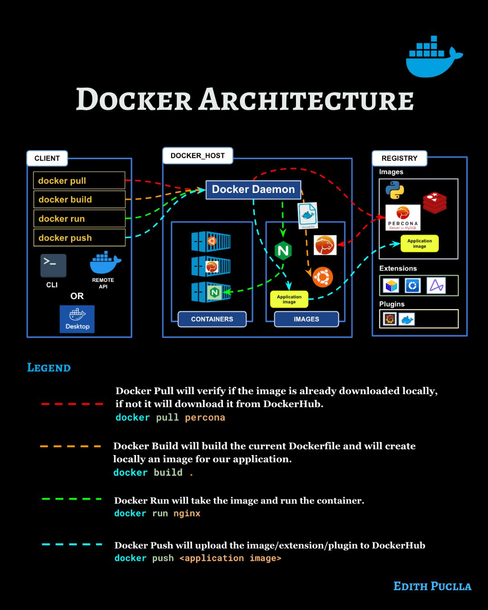

## Professor Messer's Quick Reference Guide to NMAP
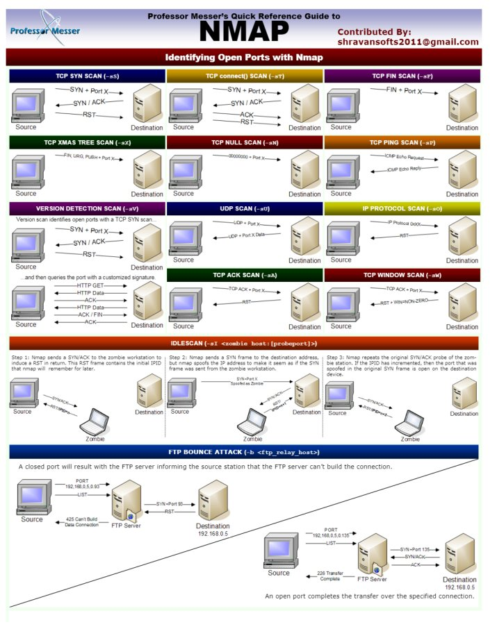

## Search engines for pentesters

## "The Full Stack"
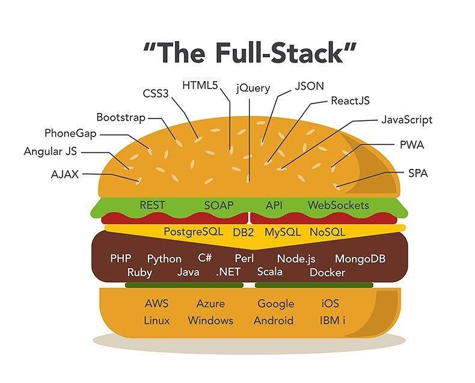

## Web App penetration testing

## Sidecar container pattern

## Metaslpoit cheat sheet
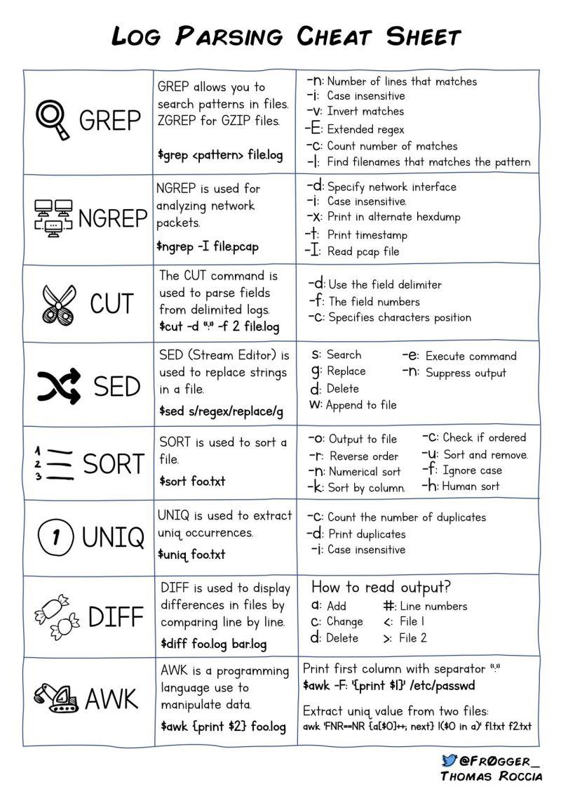

## Log parsing cheat sheet
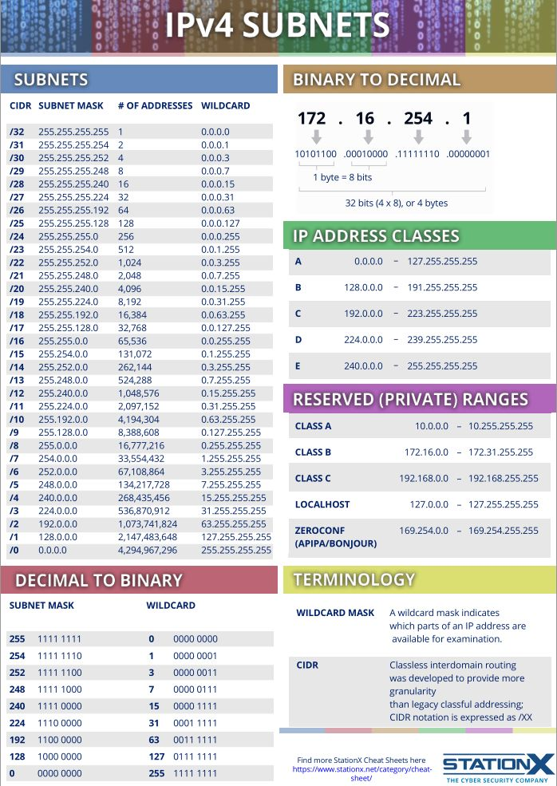

## IPv4 subnets

## Kubernetes operators 
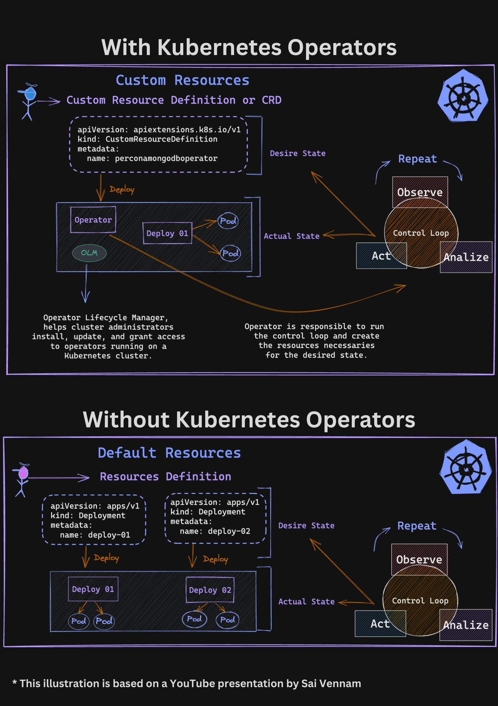

## Powershell cheat sheet
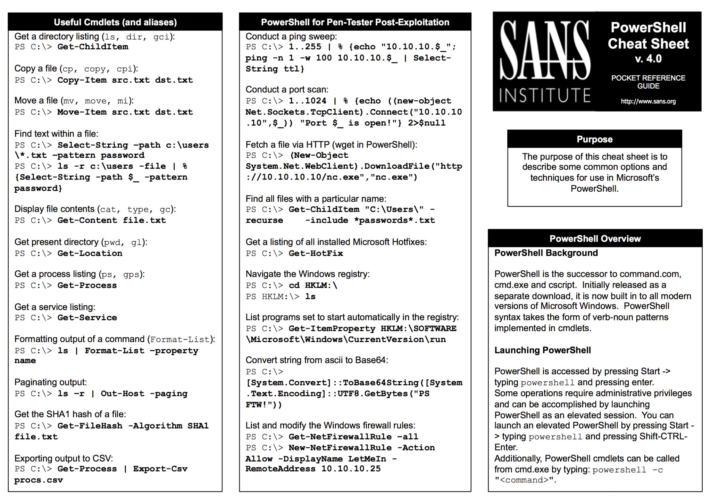

## Windows security log reference

## Deprecated Linux command and their replacement cheat sheet:

## Python Cheat Sheet: 14 interview questions

## log4shell explained

## Anatomy of Yara rule
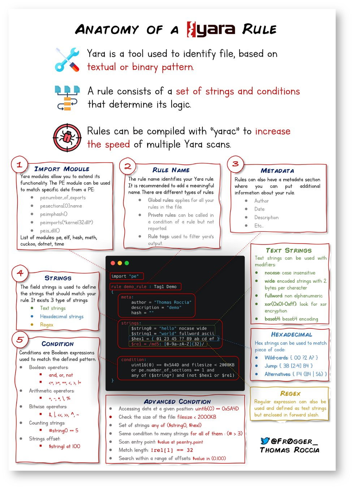

## Useful infosec tools
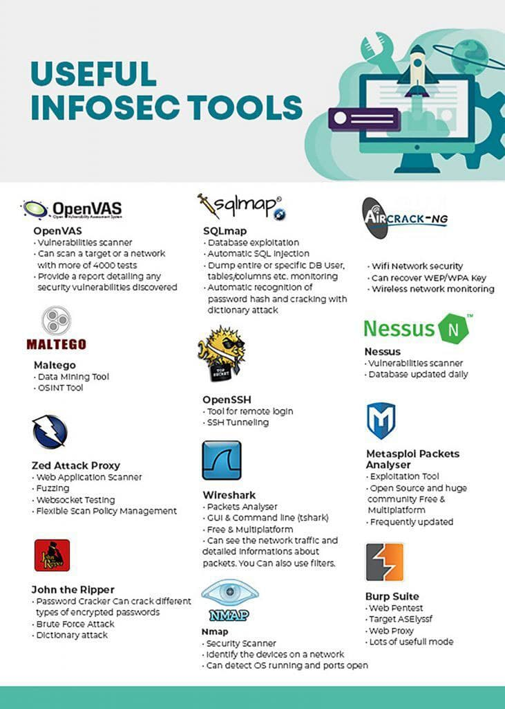

## Security testing tools
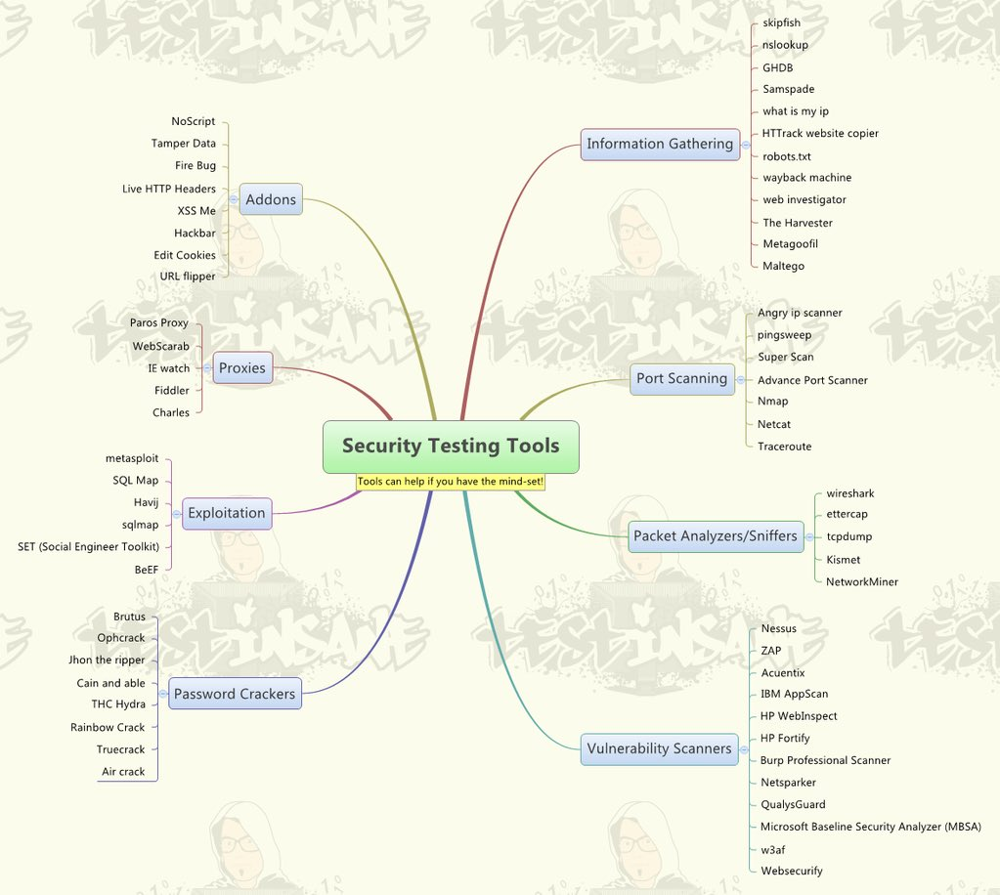

## every Linux networkin tool (I Kknow)

## Apple Pay and Google Pay Security
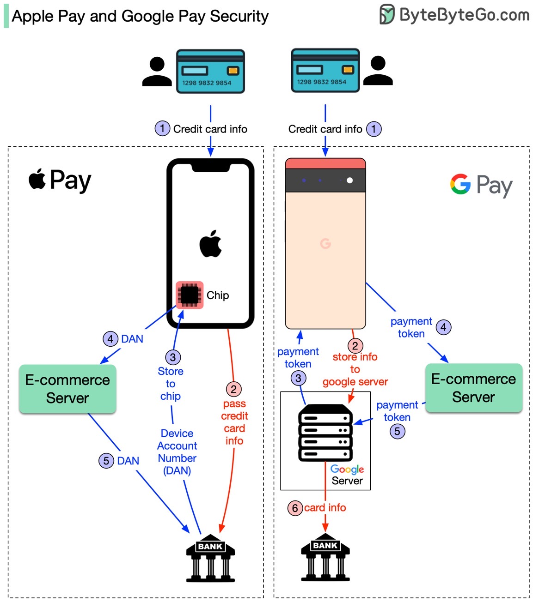
